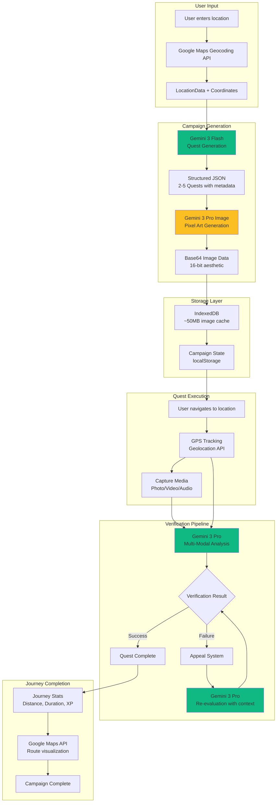
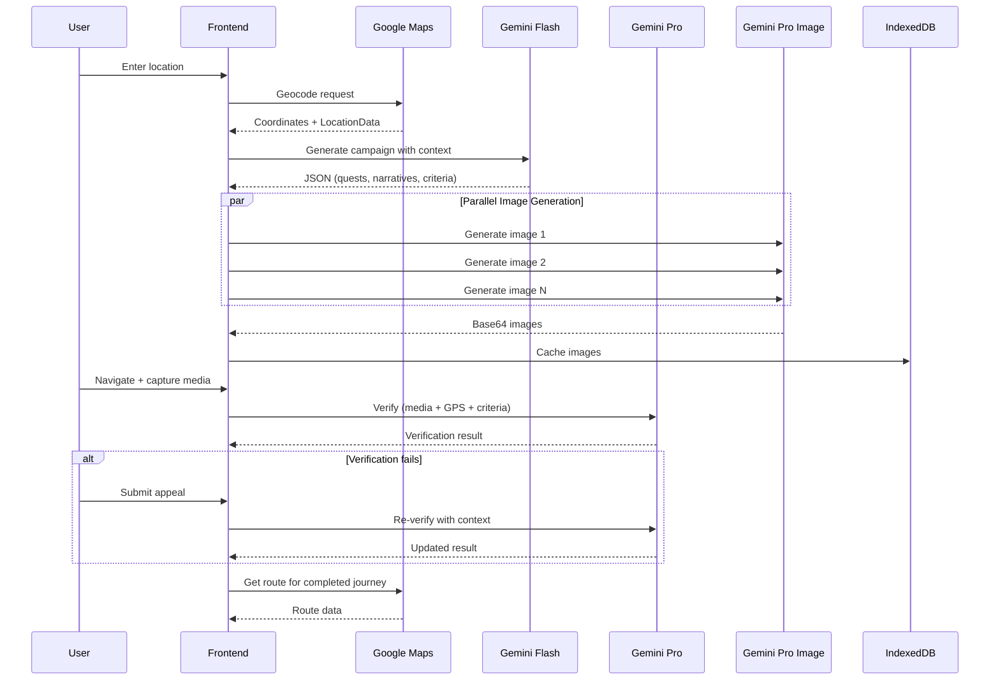

# SideQuest

> AI-powered location-based scavenger hunt game powered by **Google Gemini 3**

[](https://ai.google.dev/)
[](https://ai.google.dev/competition)
[](https://nextjs.org/)
[](https://www.typescriptlang.org/)

---

## Overview

**SideQuest** transforms any city into an interactive adventure playground using Google's Gemini 3 AI. Enter a location anywhere in the world, and the AI generates personalized scavenger hunts with culturally relevant quests, 16-bit pixel art visualizations, and intelligent multi-modal verification.

Built for solo travelers, urban explorers, and anyone who wants to discover their city through AI-curated adventures. The game combines real-world exploration with retro gaming aesthetics and smart AI that understands photos, videos, and audio recordings.

---

## Demo

**Live Demo:** [sidequest-seven.vercel.app](https://sidequest-seven.vercel.app)

**Demo Video:** [Watch 3-minute demo on Vimeo](https://vimeo.com/1162065822)

**Repository:** [github.com/comradeflats/sidequest](https://github.com/comradeflats/sidequest)

---

## Gemini 3 Integration

SideQuest showcases the **full multi-modal capabilities** of Google's Gemini 3 model family—text generation, vision analysis, audio understanding, and image synthesis—working together in a single application.

### Models Used

| Model | Purpose | Implementation |
|-------|---------|----------------|
| **Gemini 3 Flash** | Quest Generation | Creates culturally-aware, location-specific challenges with narratives, objectives, and hidden verification criteria |
| **Gemini 3 Pro** | Media Verification | Analyzes **photos, videos, and audio recordings** against quest objectives with advanced reasoning and GPS context |
| **Gemini 3 Pro Image** | Image Synthesis | Generates 16-bit pixel art visualizations for each quest in SNES/Genesis aesthetic |

### Technical Implementation

**Quest Generation Pipeline:**
- User inputs any global location (e.g., "Da Nang, Vietnam", "New York City")
- Gemini 3 Flash generates structured JSON with 2-5 quests based on campaign type
- Each quest includes: narrative backstory, public objective, secret verification criteria, GPS coordinates, and difficulty rating
- Cultural context is automatically incorporated based on location

**Multi-Modal Quest Verification:**
- Quests can require different media types: **photos, video recordings, or audio recordings**
- Gemini 3 Pro analyzes all media types with its advanced multi-modal capabilities:
  - **Photo quests**: Capture images of landmarks, objects, or scenes
  - **Video quests**: Record 5-30 second clips demonstrating actions or environments
  - **Audio quests**: Record 10-60 seconds of ambient sounds, music, or spoken content
- GPS-enhanced verification: more forgiving when user is within 30 meters of target location
- Appeal system allows users to provide context when AI makes mistakes, triggering re-evaluation

**16-Bit Image Generation:**
- Gemini 3 Pro Image generates quest visualizations with consistent retro aesthetic
- Custom prompt engineering for SNES/Genesis-era pixel art style
- Images cached in IndexedDB (~50MB storage) to minimize API costs on session resume
- Parallel generation for all quest images during campaign creation

### Code References

- Quest generation prompts: `lib/game-logic.ts`
- Gemini model configuration: `lib/gemini.ts`
- Vision verification logic: `lib/game-logic.ts`
- Image caching system: `lib/indexeddb-storage.ts`

---

## Key Features

### AI-Powered Gameplay
- **Dynamic Quest Generation** - Culturally-aware challenges for any location worldwide
- **Multi-Modal Verification** - AI analyzes photos, videos, and audio recordings with GPS context
- **Appeal System** - Explain context when verification fails; AI reconsiders with your input
- **16-Bit Art Generation** - Every quest includes unique pixel art visualization

### Journey Tracking & Navigation
- **Live GPS Tracking** - Records walking path throughout campaign
- **Journey Stats** - Real-time distance, duration, and waypoint tracking
- **Native Maps Integration** - Opens Google Maps with walking directions
- **Fuzzy Location View** - Shows general area without spoiling exact location (75-150m offset)

### Retro Gaming Aesthetic
- 16-bit pixel art inspired by SNES/Genesis era
- Terminal-inspired UI with emerald green color scheme
- Smooth animations with Framer Motion
- Monospace fonts and ALL_CAPS styling

### Mobile Optimization
- Battery-efficient GPS tracking (<10% per 30min)
- Responsive design optimized for mobile devices
- Touch-friendly interface for on-the-go gameplay

---

## How It Works

1. **Choose Your Adventure**
   - Enter any location worldwide
   - Select campaign type:
     - **QUICK_HUNT**: 2-3 nearby quests (~1 hour)
     - **CITY_ODYSSEY**: 4-5 quests across the city (full day)

2. **AI Generates Your Quest**
   - Gemini 3 Flash creates location-specific challenges
   - Gemini 3 Pro Image generates 16-bit pixel art for each quest
   - Each quest includes narrative backstory, objectives, and hidden verification criteria

3. **Navigate to Quest**
   - View live journey stats (distance, duration)
   - Tap "VIEW AREA ON MAP" to see general neighborhood
   - GPS tracking records your exploration path

4. **Complete with Photos, Video, or Audio**
   - Capture quest objectives using the required media type
   - **Photo quests**: Snap pictures of landmarks, objects, or scenes
   - **Video quests**: Record short clips (5-30s) of actions or environments
   - **Audio quests**: Capture ambient sounds, music, or spoken content (10-60s)
   - Gemini 3 Pro analyzes all media types with GPS context
   - Appeal with text explanation if verification fails

5. **Complete & Progress**
   - Unlock new quests as you complete challenges
   - View journey map with walking directions at completion
   - Track total distance and time across your adventure

---

## Architecture

### System Overview



### Data Flow



### Gemini 3 Model Strategy

| Model | Use Case | Rationale |
|-------|----------|-----------|
| **Gemini 3 Flash** | Quest generation (text → JSON) | Fast structured output for campaign creation |
| **Gemini 3 Pro** | Multi-modal verification (photo/video/audio) | Superior reasoning for complex verification decisions |
| **Gemini 3 Pro Image** | Pixel art generation | Only Gemini 3 image model available |

**Key Optimization:** Each model is selected for its strengths—Flash for speed, Pro for reasoning quality, Pro Image for visual generation.

---

## Tech Stack

### Frontend
- **Next.js 16.1.1** - React framework with App Router
- **React 19.2.3** - UI library
- **TypeScript 5** - Type safety
- **Tailwind CSS 4** - Utility-first styling
- **Framer Motion 12** - Animations

### AI & APIs
- **@google/generative-ai 0.24.1** - Google Gemini SDK
- **Gemini 3 Flash** - Quest generation (fast JSON structured output)
- **Gemini 3 Pro** - Multi-modal verification (photo/video/audio analysis)
- **Gemini 3 Pro Image** - Image generation

### Storage & Media
- **IndexedDB** - Local image caching (~50MB)
- **react-webcam 7.2.0** - Camera access

---

## Getting Started

### Prerequisites
- Node.js 18+
- Google Cloud account with billing enabled
- Gemini API key

### Installation

```bash
# Clone the repository
git clone https://github.com/comradeflats/sidequest.git
cd sidequest

# Install dependencies
npm install

# Set up environment variables
echo "NEXT_PUBLIC_GEMINI_API_KEY=your_api_key_here" > .env.local

# Run development server
npm run dev
```

Open [http://localhost:3000](http://localhost:3000) in your browser.

### Getting Your API Key

1. Go to [Google Cloud Console](https://console.cloud.google.com/)
2. Enable the **Generative Language API**
3. Enable billing (free $300 credits available)
4. Create credentials: API Key
5. Add to `.env.local`

**Note:** Gemini 3 Pro Image requires billing. Free tier only supports Gemini 3 Flash.

---

## Project Structure

```
sidequest/
├── app/
│   ├── page.tsx              # Main game interface
│   ├── layout.tsx            # Root layout with metadata
│   └── globals.css           # Global styles + pixel art CSS
├── components/
│   └── MediaScanner.tsx      # Multi-modal media capture (photo/video/audio)
├── lib/
│   ├── gemini.ts             # Gemini 3 model configuration
│   ├── game-logic.ts         # Campaign generation & verification
│   └── indexeddb-storage.ts  # Image caching system
├── types/
│   └── index.ts              # TypeScript interfaces
└── public/                   # Static assets
```

---

## Troubleshooting

| Issue | Solution |
|-------|----------|
| **API Quota Exceeded (429)** | Switch from free tier to Google Cloud API key with billing |
| **Images Not Generating** | Gemini 3 Pro Image requires billing; verify Google Cloud API key |
| **Camera Not Working** | Grant browser permissions; use HTTPS in production |

---

## License

MIT License - see [LICENSE](LICENSE) for details.

---

## Acknowledgments

- **Google Gemini Team** - Gemini 3 API
- **Vercel** - Next.js framework
- **Tailwind Labs** - Tailwind CSS

---

**Built by [@comradeflats](https://github.com/comradeflats) for the Gemini 3 Hackathon 2026**

*Explore your world. One quest at a time.*
